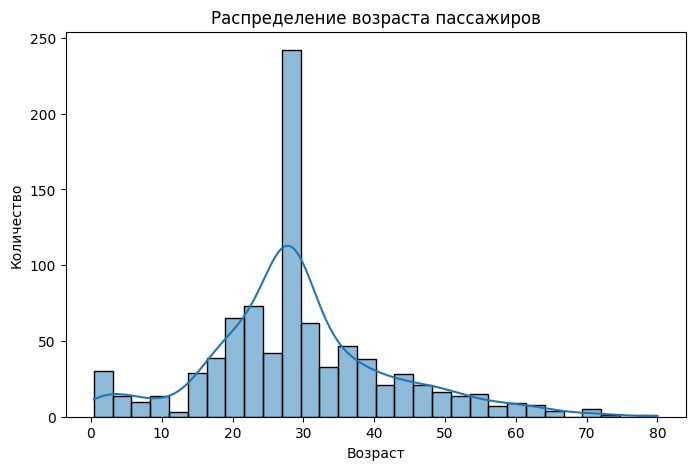
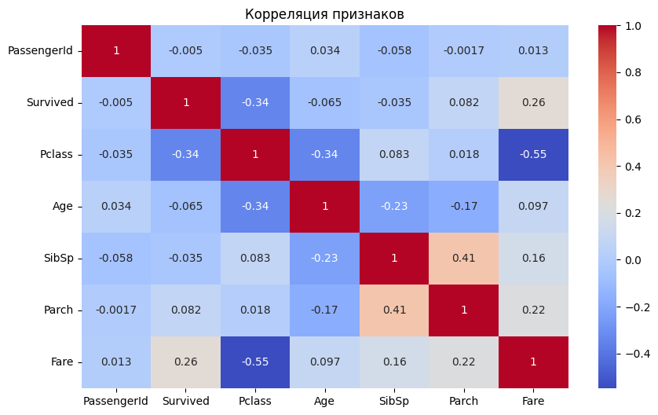
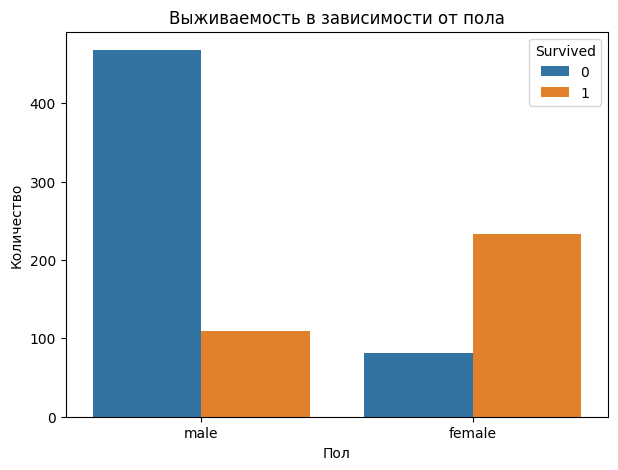
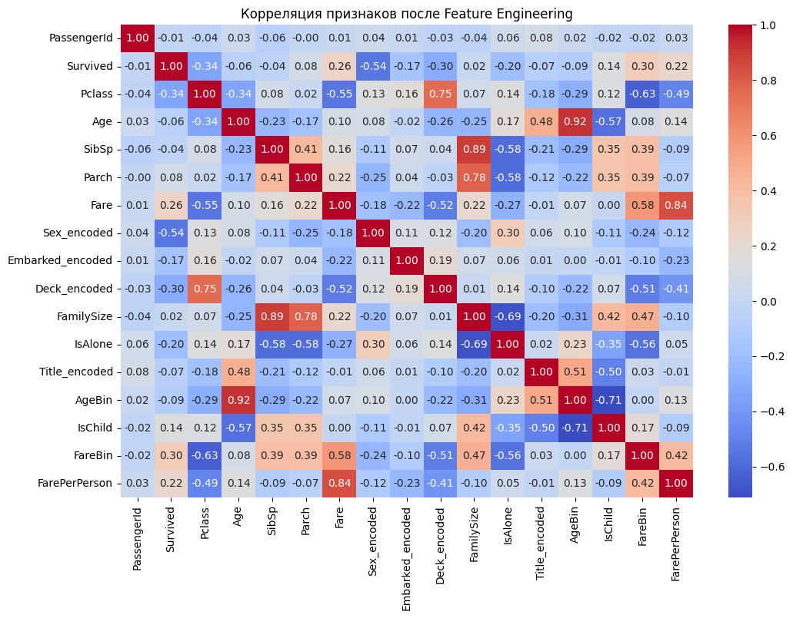
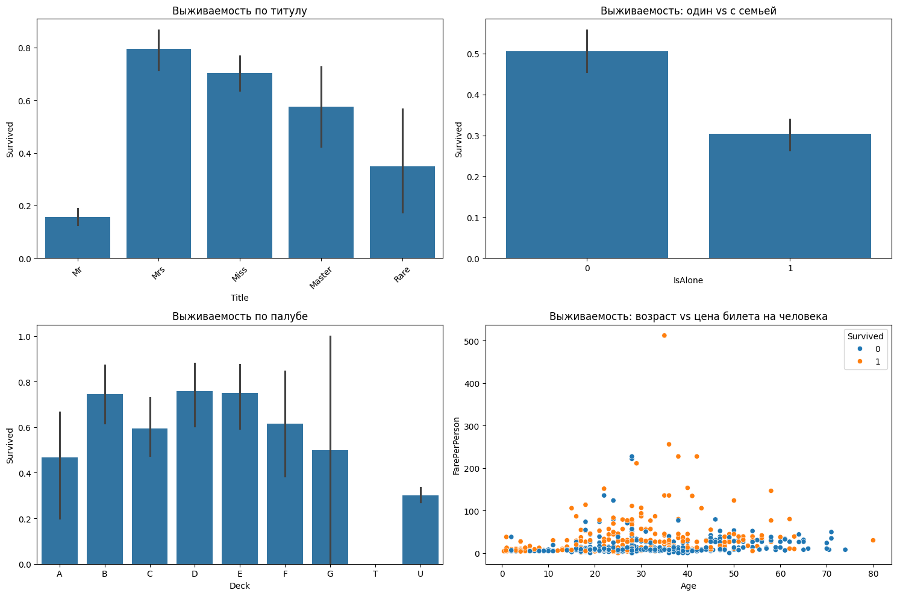
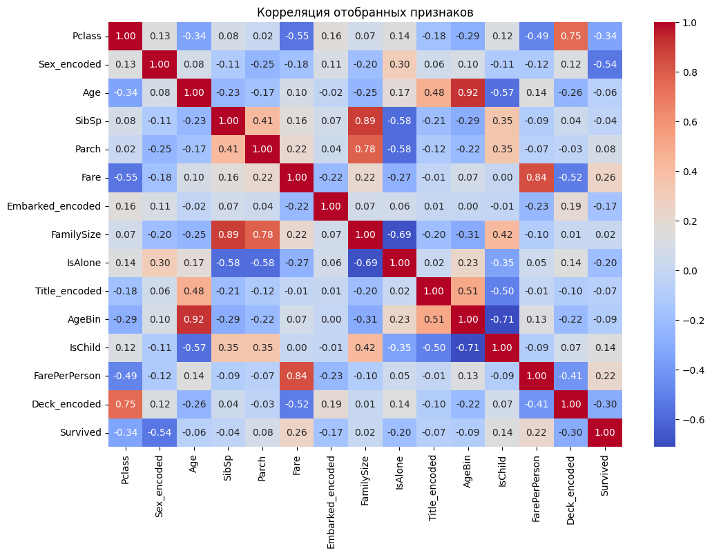
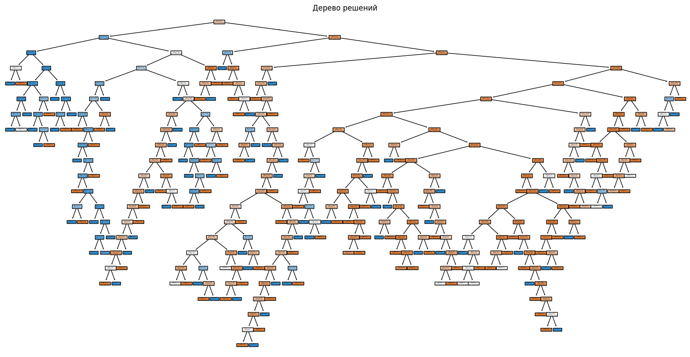

# EDA и ресерч-анализ

## Импорт всех необходимых библиотек.


```python
import pandas as pd
import seaborn as sns
import matplotlib.pyplot as plt
```

## Загрузка и предобработка данных


```python
df = pd.read_csv("titanic.csv")
print("Пропущенные значения:\n", df.isnull().sum())

df['Age'] = df['Age'].fillna(df['Age'].median())
df['Cabin'] = df['Cabin'].fillna('Unknown')
```

    Пропущенные значения:
     PassengerId      0
    Survived         0
    Pclass           0
    Name             0
    Sex              0
    Age            177
    SibSp            0
    Parch            0
    Ticket           0
    Fare             0
    Cabin          687
    Embarked         2
    dtype: int64


## Описательная статистика и распределение возраста пассажиров


```python
print("Статистика данных:\n", df.describe())

plt.figure(figsize=(8,5))
sns.histplot(df['Age'], bins=30, kde=True)
plt.title("Распределение возраста пассажиров")
plt.xlabel("Возраст")
plt.ylabel("Количество")
plt.show()
```

    Статистика данных:
            PassengerId    Survived      Pclass         Age       SibSp  \
    count   891.000000  891.000000  891.000000  891.000000  891.000000   
    mean    446.000000    0.383838    2.308642   29.361582    0.523008   
    std     257.353842    0.486592    0.836071   13.019697    1.102743   
    min       1.000000    0.000000    1.000000    0.420000    0.000000   
    25%     223.500000    0.000000    2.000000   22.000000    0.000000   
    50%     446.000000    0.000000    3.000000   28.000000    0.000000   
    75%     668.500000    1.000000    3.000000   35.000000    1.000000   
    max     891.000000    1.000000    3.000000   80.000000    8.000000   
    
                Parch        Fare  
    count  891.000000  891.000000  
    mean     0.381594   32.204208  
    std      0.806057   49.693429  
    min      0.000000    0.000000  
    25%      0.000000    7.910400  
    50%      0.000000   14.454200  
    75%      0.000000   31.000000  
    max      6.000000  512.329200  


    

    


## Корреляция колонок с Survived


```python
numeric_df = df.select_dtypes(include=['number'])

plt.figure(figsize=(10,6))
sns.heatmap(numeric_df.corr(), annot=True, cmap="coolwarm")
plt.title("Корреляция признаков")
plt.show()
```


    

    


## Анализ влияния пола на выживаемость


```python
plt.figure(figsize=(7,5))
sns.countplot(data=df, x="Sex", hue="Survived")
plt.title("Выживаемость в зависимости от пола")
plt.xlabel("Пол")
plt.ylabel("Количество")
plt.show()
```


    

    


# Feature Engineering

## Обработка категориальных признаков


```python
# Кодирование категориальных признаков
from sklearn.preprocessing import LabelEncoder

# Преобразование пола в числовой формат (0 - male, 1 - female)
df['Sex_encoded'] = LabelEncoder().fit_transform(df['Sex'])

# Преобразование порта посадки (заполняем пропуски самым частым значением 'S')
df['Embarked'] = df['Embarked'].fillna('S')
df['Embarked_encoded'] = LabelEncoder().fit_transform(df['Embarked'])

# Извлечение информации из каюты (первая буква обозначает палубу)
df['Deck'] = df['Cabin'].apply(lambda x: x[0] if x != 'Unknown' else 'U')
df['Deck_encoded'] = LabelEncoder().fit_transform(df['Deck'])
```

## Создание новых признаков


```python
# Семейные признаки
df['FamilySize'] = df['SibSp'] + df['Parch'] + 1  # Общий размер семьи
df['IsAlone'] = (df['FamilySize'] == 1).astype(int)  # Путешествует один

# Признаки на основе имени (извлечение титула)
df['Title'] = df['Name'].str.extract(r' ([A-Za-z]+)\.', expand=False)
df['Title'] = df['Title'].replace(['Lady', 'Countess','Capt', 'Col', 'Don', 'Dr', 
                                   'Major', 'Rev', 'Sir', 'Jonkheer', 'Dona'], 'Rare')
df['Title'] = df['Title'].replace('Mlle', 'Miss')
df['Title'] = df['Title'].replace('Ms', 'Miss')
df['Title'] = df['Title'].replace('Mme', 'Mrs')
df['Title_encoded'] = LabelEncoder().fit_transform(df['Title'])

# Признаки на основе возраста
df['AgeBin'] = pd.cut(df['Age'], bins=[0, 12, 18, 35, 60, 100], labels=[1, 2, 3, 4, 5]).astype(float)
df['IsChild'] = (df['Age'] < 16).astype(int)

# Признаки на основе цены билета
df['FareBin'] = pd.qcut(df['Fare'], 4, labels=[1, 2, 3, 4]).astype(float)
df['FarePerPerson'] = df['Fare'] / df['FamilySize']
```

## Анализ новых признаков


```python
# Проверим корреляцию новых признаков с целевой переменной
new_features = ['FamilySize', 'IsAlone', 'Title_encoded', 'AgeBin', 'IsChild', 'FareBin', 'FarePerPerson', 'Deck_encoded']
numeric_df = df.select_dtypes(include=['number'])

plt.figure(figsize=(12,8))
sns.heatmap(numeric_df.corr(), annot=True, cmap="coolwarm", fmt=".2f")
plt.title("Корреляция признаков после Feature Engineering")
plt.show()

# Посмотрим на самые важные корреляции с Survived
corr_with_target = numeric_df.corr()['Survived'].sort_values(ascending=False)
print("Корреляция признаков с целевой переменной Survived:")
print(corr_with_target[1:11])  # Пропускаем сам Survived
```


    

    


    Корреляция признаков с целевой переменной Survived:
    FareBin          0.299357
    Fare             0.257307
    FarePerPerson    0.221600
    IsChild          0.136107
    Parch            0.081629
    FamilySize       0.016639
    PassengerId     -0.005007
    SibSp           -0.035322
    Age             -0.064910
    Title_encoded   -0.071174
    Name: Survived, dtype: float64


## Визуализация новых признаков


```python
# Визуализация влияния новых признаков
plt.figure(figsize=(15, 10))

plt.subplot(2, 2, 1)
sns.barplot(x='Title', y='Survived', data=df)
plt.title('Выживаемость по титулу')
plt.xticks(rotation=45)

plt.subplot(2, 2, 2)
sns.barplot(x='IsAlone', y='Survived', data=df)
plt.title('Выживаемость: один vs с семьей')

plt.subplot(2, 2, 3)
sns.barplot(x='Deck', y='Survived', data=df, order=sorted(df['Deck'].unique()))
plt.title('Выживаемость по палубе')

plt.subplot(2, 2, 4)
sns.scatterplot(x='Age', y='FarePerPerson', hue='Survived', data=df)
plt.title('Выживаемость: возраст vs цена билета на человека')

plt.tight_layout()
plt.show()
```


    

    


## Feature Selection


```python
# Выберем наиболее релевантные признаки для модели
selected_features = [
    'Pclass',
    'Sex_encoded',
    'Age',
    'SibSp',
    'Parch',
    'Fare',
    'Embarked_encoded',
    'FamilySize',
    'IsAlone',
    'Title_encoded',
    'AgeBin',
    'IsChild',
    'FarePerPerson',
    'Deck_encoded'
]

# Создадим новый датафрейм с отобранными признаками
df_engineered = df[selected_features + ['Survived']].copy()

# Проверим финальную корреляцию
plt.figure(figsize=(12,8))
sns.heatmap(df_engineered.corr(), annot=True, cmap="coolwarm", fmt=".2f")
plt.title("Корреляция отобранных признаков")
plt.show()
```


    

    


# Эксперименты

### Линейная модель машинного обучения


```python
from sklearn.model_selection import train_test_split
from sklearn.preprocessing import OneHotEncoder, StandardScaler
from sklearn.impute import SimpleImputer
from sklearn.pipeline import Pipeline
from sklearn.compose import ColumnTransformer
from sklearn.linear_model import LogisticRegression
from sklearn.metrics import accuracy_score, classification_report

data = pd.read_csv("Titanic.csv")

target = 'Survived'
features = ['Pclass', 'Sex', 'Age', 'SibSp', 'Parch', 'Fare', 'Embarked']
X = data[features]
y = data[target]

tnumeric = ['Age', 'SibSp', 'Parch', 'Fare']
numeric_pipeline = Pipeline([
    ('imputer', SimpleImputer(strategy='median')),
    ('scaler', StandardScaler())
])

tcategorical = ['Pclass', 'Sex', 'Embarked']
categorical_pipeline = Pipeline([
    ('imputer', SimpleImputer(strategy='most_frequent')),
    ('onehot', OneHotEncoder(handle_unknown='ignore'))
])

preprocessor = ColumnTransformer([
    ('num', numeric_pipeline, tnumeric),
    ('cat', categorical_pipeline, tcategorical)
])

model = Pipeline([
    ('preprocessor', preprocessor),
    ('classifier', LogisticRegression(max_iter=1000))
])

X_train, X_test, y_train, y_test = train_test_split(
    X, y, test_size=0.2, random_state=42, stratify=y
)

model.fit(X_train, y_train)

y_pred = model.predict(X_test)
print(f'Accuracy: {accuracy_score(y_test, y_pred):.3f}')
print('Classification Report:\n', classification_report(y_test, y_pred))

feature_names = model.named_steps['preprocessor'].get_feature_names_out()
coefficients = model.named_steps['classifier'].coef_[0]

coef_df = pd.DataFrame({
    'feature': feature_names,
    'coefficient': coefficients
}).sort_values(by='coefficient', ascending=False)

print('Coefficients:\n', coef_df)

```

    Accuracy: 0.804
    Classification Report:
                   precision    recall  f1-score   support
    
               0       0.81      0.89      0.85       110
               1       0.79      0.67      0.72        69
    
        accuracy                           0.80       179
       macro avg       0.80      0.78      0.79       179
    weighted avg       0.80      0.80      0.80       179
    
    Coefficients:
                 feature  coefficient
    7   cat__Sex_female     1.364351
    4     cat__Pclass_1     1.038653
    10  cat__Embarked_Q     0.348068
    5     cat__Pclass_2     0.138022
    3         num__Fare     0.133851
    9   cat__Embarked_C     0.095733
    2        num__Parch    -0.070794
    1        num__SibSp    -0.261398
    11  cat__Embarked_S    -0.321817
    0          num__Age    -0.489323
    6     cat__Pclass_3    -1.054692
    8     cat__Sex_male    -1.242368


### Деревья


```python
import numpy as np
from sklearn.model_selection import train_test_split
from sklearn.tree import DecisionTreeClassifier, plot_tree
from sklearn.metrics import accuracy_score
from sklearn.preprocessing import LabelEncoder
import matplotlib.pyplot as plt

df = pd.read_csv('titanic.csv')

df = df[['Survived', 'Pclass', 'Sex', 'Age', 'SibSp', 'Parch', 'Fare', 'Embarked']]

df['Age'] = df['Age'].fillna(df['Age'].median())
df['Embarked'] = df['Embarked'].fillna(df['Embarked'].mode()[0])

le_sex = LabelEncoder()
le_embarked = LabelEncoder()
df['Sex'] = le_sex.fit_transform(df['Sex'])
df['Embarked'] = le_embarked.fit_transform(df['Embarked'])

X = df.drop('Survived', axis=1)
y = df['Survived']

X_train, X_test, y_train, y_test = train_test_split(X, y, test_size=0.2, random_state=42)

model = DecisionTreeClassifier(random_state=42)
model.fit(X_train, y_train)

y_pred = model.predict(X_test)
accuracy = accuracy_score(y_test, y_pred)
print(f'Accuracy: {accuracy:.2f}')

plt.figure(figsize=(20, 10))
plot_tree(model, feature_names=X.columns, class_names=['Not Survived', 'Survived'], filled=True)
plt.title("Дерево решений")
plt.show()

```

    Accuracy: 0.78


    

    

