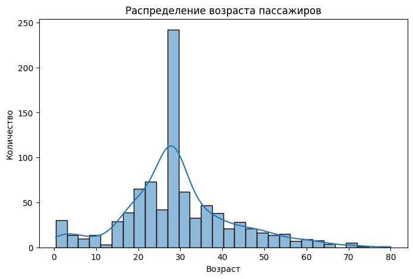
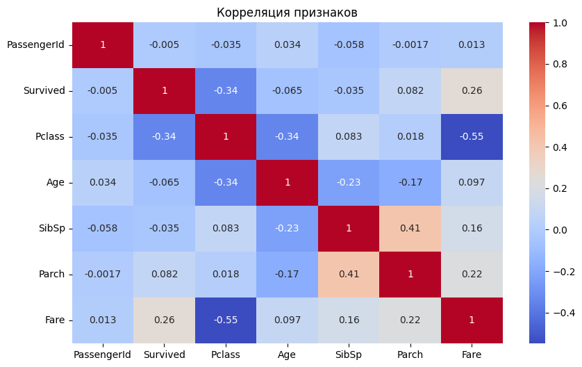
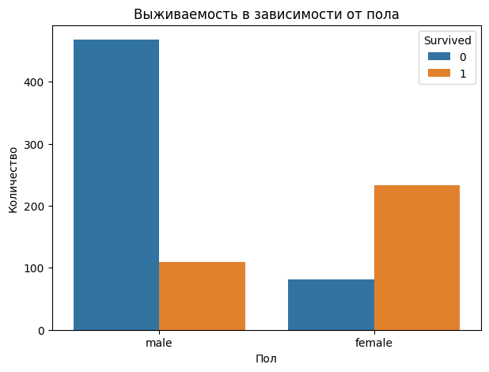

## Импорт всех необходимых библиотек.


```python
import pandas as pd
import seaborn as sns
import matplotlib.pyplot as plt
```

## Загрузка и предобработка данных


```python
df = pd.read_csv("titanic.csv")
print("Пропущенные значения:\n", df.isnull().sum())

df['Age'] = df['Age'].fillna(df['Age'].median())
df['Cabin'] = df['Cabin'].fillna('Unknown')
```

    Пропущенные значения:
     PassengerId      0
    Survived         0
    Pclass           0
    Name             0
    Sex              0
    Age            177
    SibSp            0
    Parch            0
    Ticket           0
    Fare             0
    Cabin          687
    Embarked         2
    dtype: int64


## Описательная статистика и распределение возраста пассажиров


```python
print("Статистика данных:\n", df.describe())

plt.figure(figsize=(8,5))
sns.histplot(df['Age'], bins=30, kde=True)
plt.title("Распределение возраста пассажиров")
plt.xlabel("Возраст")
plt.ylabel("Количество")
plt.show()
```

    Статистика данных:
            PassengerId    Survived      Pclass         Age       SibSp  \
    count   891.000000  891.000000  891.000000  891.000000  891.000000   
    mean    446.000000    0.383838    2.308642   29.361582    0.523008   
    std     257.353842    0.486592    0.836071   13.019697    1.102743   
    min       1.000000    0.000000    1.000000    0.420000    0.000000   
    25%     223.500000    0.000000    2.000000   22.000000    0.000000   
    50%     446.000000    0.000000    3.000000   28.000000    0.000000   
    75%     668.500000    1.000000    3.000000   35.000000    1.000000   
    max     891.000000    1.000000    3.000000   80.000000    8.000000   
    
                Parch        Fare  
    count  891.000000  891.000000  
    mean     0.381594   32.204208  
    std      0.806057   49.693429  
    min      0.000000    0.000000  
    25%      0.000000    7.910400  
    50%      0.000000   14.454200  
    75%      0.000000   31.000000  
    max      6.000000  512.329200  


    

    


## Корреляция колонок с Survived


```python
numeric_df = df.select_dtypes(include=['number'])

plt.figure(figsize=(10,6))
sns.heatmap(numeric_df.corr(), annot=True, cmap="coolwarm")
plt.title("Корреляция признаков")
plt.show()
```


    

    


## Анализ влияния пола на выживаемость


```python
plt.figure(figsize=(7,5))
sns.countplot(data=df, x="Sex", hue="Survived")
plt.title("Выживаемость в зависимости от пола")
plt.xlabel("Пол")
plt.ylabel("Количество")
plt.show()
```


    

    

